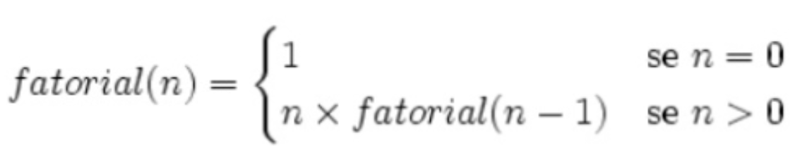
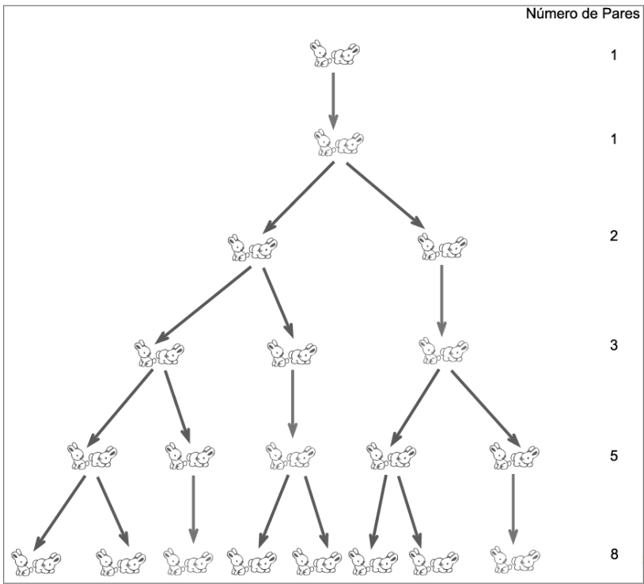
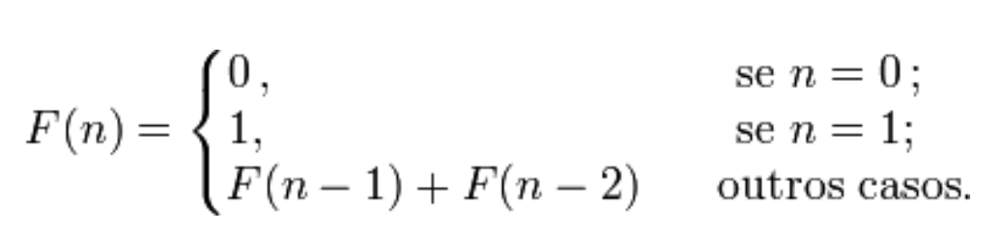
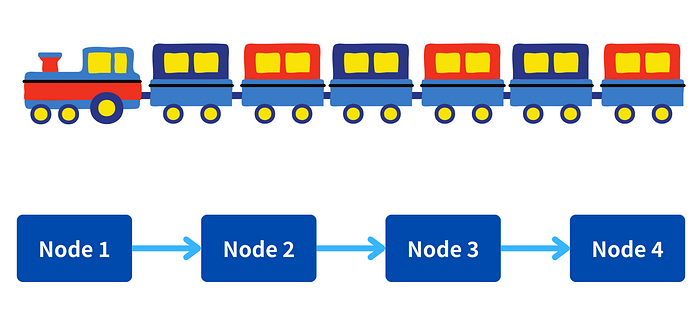
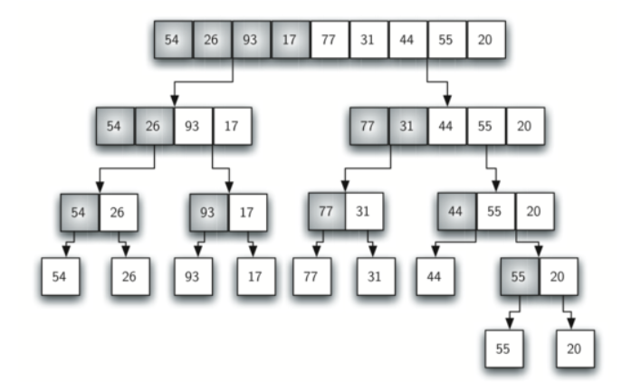
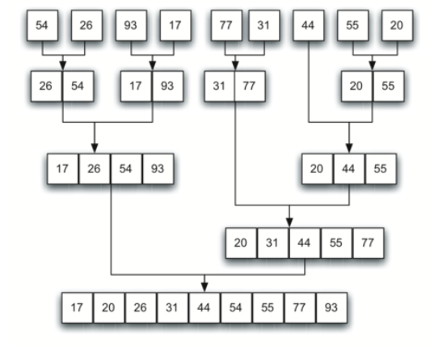

# Recursividade

## Definição


Recursão é o processo de definir algo em termos de si mesmo e é, algumas vezes, chamado de definição circular.
O conceito de algo recursivo está dentro de si, que por sua vez está dentro de si e assim sucessivamente, infinitamente

    Veja [este vídeo](https://www.youtube.com/watch?v=cHZWZhHQq4g&source_ve_path=MjM4NTE) para compreender alguns conceitos básicos sobre recusividade a partir da sequência de fibonacci.

A sequencia de fibonacci descrita no vídeo anterior é um exemplo de função recursiva. Os números presentes nesta sequencia e suas relações aparecem em diversmos momentos na natureza. 


Na computação o conceito de recursividade é amplamente utilizado, mas difere da recursividade típica por apresentar uma condição que provoca o fim do ciclo recursivo. 

A recursividade é um recurso de programação que deve ser usado com sabedoria, pois caso a condição de parada não seja bem definida o programa entrará em um loop infinito 

Em muitos casos, um problema pode ser resolvido com o uso de estrutura de repetição do tipo while ou do tipo for. 

    A recursividade é uma forma de trabalhar com problemas por meio da **divisão** do problema em partes menores quando as partes menores possuem a mesma natureza e solucioná-los (conquista) após estes passos.

## Estrutura de Funções Recursivas

Para criar uma função é recursiva devemos dividir a solução em duas etapas:
- Estabelecer a condição de parada, ou seja, o caso trivial com o qual sabemos o retorno exato.
- Existir uma chamada para a própria função com a redução do problema em problemas menores 

### Funções Matemáticas

#### Fatorial 

Fatorial é um número natural inteiro positivo, o qual é representado por **n!**. O fatorial de um número é calculado pela multiplicação desse número por todos os seus antecessores até chegar ao número 1. Note que nesses produtos, o zero (0) é excluído.

- O fatorial é representado por:
n! = n . (n – 1) . (n – 2) . (n – 3)!

- Um fatorial de um número inteiro não negativo é uma função definida como




Vejamos o exemplo de fatorial do  número 6:

    - 6!
    - 6 * 5! 
    - 6 * 5 * 4! 
    - 6 * 5 * 4 *3!
    - 6 * 5 * 4 *3 *2!
    - 6 * 5 * 4 *3 *2 *1!
    - 6 * 5 * 4 *3 *2 *1 * 0!
    - 6 * 5 * 4 *3 *2 *1 * 1

A implementação da função fatorial usando a linguagem Python pode ser da seguinte maneira utilizando estruturas de repetição:

```py
def fatorial(numero):
    if numero < 2:
        return 1

    total = 1
    for n in range(numero, -1):
        total *= n

    return total
    
```
O fatorial de um número também pode ser resolvido  recursivamente. Seguindo as regras da função, temos:
- Condição de parada: n! = 1, se n = 0
- Chamada da própria função: n! = n * (n-1)! , se n > 0

```py
def fatorial_recursivo(numero):
    if numero < 2:
        return 1
    else:
        return fatorial_recursivo(numero - 1) * numero
```

A versão não-recursiva de fatorial usa um laço que é executado de 1 a n e multiplica progressivamente cada número pelo produto. 

A versão recursiva pode ser confusa inicialmente, mas possui verbosidade menor. Quando fatorial_recursivo é chamada com um argumento menor que 2, a função devolve 1. Caso contrário, ela devolve o produto de fatorial_recursivo(n-1) * n. 

Para avaliar essa expressão, fatorial_recursivo é chamada com n-1. Isso acontece até que n se iguale a 1 e as chamadas à função comecem a retornar.

    No programa recursivo para calcular o fatorial de 6, o computador tem de calcular primeiro o fatorial de 5 e só depois é que faz a multiplicação de 6 pelo resultado. 
    
    Para calcular o fatorial de 5, vai ter de calcular o fatorial de 4 para depois multiplicar por 5. 
    
    Para calcular o fatorial de 4, vai ter que calcular o fatorial 3 para depois multiplicar por 4 e assim por diante até que tenha que calcular o fatorial de 1 quando o valor é determinado diretamente ao invés de fazer uma nova chamada recursiva. 

Ao se determinar o valor diretamente o processo de chamadas recursivas é interrompido e o valor retornado para a função recursiva que o chamou. O resultado é retornado para a função que a chamou anteriormente, repetindo o processo até que seja retornado o valor do fatorial para a primeira chamada da função.

#### Série de Fibonacci

Fibonacci (matemático da Renascença italiana) utilizou uma série curiosa de números para modelar o número de casais de coelhos em sucessivas gerações. 

    Um homem pôs um par de coelhos num lugar cercado por todos os lados por um muro. Quantos pares de coelhos podem ser gerados a partir desse par em um ano se, supostamente, todos os meses cada par dá à luz um novo par, que é fértil a partir do segundo mês?




De acordo com o problema, temos que o número de pares de coelhos em determinado mês, é a soma dos pares de coelhos existentes nos dois meses anteriores a este. Na matemática, os números de Fibonacci são os números que compõe a seguinte sucessão de números inteiros.
- 1, 1, 2, 3, 5, 8, 13, 21, 34, 55, 89, 144, …

Em definição matemática a sequência é definida recursivamente pela fórmula abaixo:



## Funções Computacionais

### Utilização em Funções de Estruturas de Dados


A utilização de funções recursivas na computação é muito comum para problemas que lidam com dados de mesma natureza. Em diversos algoritmos usados em estruturas de dados existe o uso de funções recursivas. Para estruturas de dados como as árvores temos diferentes algoritmos para percurso que usam recursividade. Também em listas encadeadas podemos usar funções recursivas para percorrer linearmente os nós.


#### Listas

Em estruturas de dados uma lista pode ser criada a partir de um conjunto de nós ligados entre si, como se fossem os vagões de um trem.



Este conceito para organizar dados pode ser implementado com o código a seguir:

```py
class Node:
    def __init__(self, data):
        self.data = data
        self.next = None

class LinkedList:
    def __init__(self):
        self.head = None

    def append(self, data):
        new_node = Node(data)
        if not self.head:
            self.head = new_node
            return
        last = self.head
        while last.next:
            last = last.next
        last.next = new_node

    def display(self, start):
        if start:
            print(start.data, end=" ")
            self.display(start.next)
        else:
            print()
       
if __name__ == "__main__":
    ll = LinkedList()
    ll.append(1)
    ll.append(2)
    ll.append(3)
    ll.display(ll.head)  # Output: 1 2 3
   

```

Observe a implementação do método **display**. Nele temos a verificação para testar a condição de parada (else) e a chamada recursiva de **display**.


#### Árvores

Na computação é muito comum o uso de uma estrutura de dados chamada árvore, em particular as árvores binárias. Seguindo o mesmo conceito de nós ligados das listas a árvore binária permite que cada nó tenha até dois filhos, por isso o nome de binária. Este fato gera a característica de ser uma estrutura não linear.


A implementação é similar a das listas, onde temos os Nós e a Árvore sendo construída a parir do nó **raiz**.

```py

class Node:
    def __init__(self, data):
        self.data = data
        self.left = None
        self.right = None

class BinaryTree:
    def __init__(self):
        self.root = None

    def preorder_traversal(self, node):
        if node:
            print(node.data, end=" ")
            self.preorder_traversal(node.left)
            self.preorder_traversal(node.right)


if __name__ == "__main__":
    bt = BinaryTree()
    bt.root = Node(4)
    bt.root.left = Node(3)
    bt.root.right = Node(8)
    
    bt.root.left.left = Node(2)
    bt.root.left.right = None
    bt.root.right.left = Node(7)
    bt.root.right.right = Node(9)


    bt.preorder_traversal(bt.root) 

```

Execute observe a saída do algoritmos recursivo **pre_order**. Veja que ele percorreu indo para o nó mais a esquerda, após isso o nó acima deste e indo para o nó mais a direita. Altere o código criando o método **in_order** e fazendo a chamada dele no main. Observe que para a organização da árvore atual, com cada nó possuindo dois nós filhos com valores menores que o dela temos a impressão em ordem crescente. 


```py
    def inorder_traversal(self, node):
        if node:
            self.inorder_traversal(node.left)
            print(node.data, end=" ")
            self.inorder_traversal(node.right)

```


### Utilização em Algoritmos de busca e ordenação

Não existe apenas uma maneira para order dados em um vetor. Existem diversos algoritmos que são chamados de algoritmos de ordenação. Alguns são implementados utilizando instruções imperativas (for/if) enquanto outros são implementados de maneira recursiva.

Observe a seguir o merge sort como exemplo de algoritmo de ordenação recursivo. Faça também uma pesquisa para reconhecer a existencia de outros algoritmos.

#### Ordenação por merge

Se baseia no princípio da divisão e conquista. Ou seja, divide o problema em subproblemas e os resolve de forma independente até unir as resoluções (merge). 

O algoritmo consiste no processo de dividir e conquistar:

- Dividir a lista não ordenada em listas com a metade dos elementos, consecutivamente, até haver listas com apenas um elemento (caso base)

- Repetidamente intercalar (merge) as listas menores ordenadas e combinar em listas novas e ordenadas. 





O algoritmo do merge_sort faz exatamente os dois processos. Inicialmente divide o array recursivamente nas chamadas de **merge_sort** e após dividir até o tamanho mínimo do array realiza a união (**merge**).

```py
def merge_sort(arr):
    if len(arr) <= 1:
        return arr

    mid = len(arr) // 2
    left_half = merge_sort(arr[:mid])
    right_half = merge_sort(arr[mid:])

    return merge(left_half, right_half)

def merge(left, right):
    sorted_array = []
    left_index, right_index = 0, 0

    while left_index < len(left) and right_index < len(right):
        if left[left_index] < right[right_index]:
            sorted_array.append(left[left_index])
            left_index += 1
        else:
            sorted_array.append(right[right_index])
            right_index += 1

    sorted_array.extend(left[left_index:])
    sorted_array.extend(right[right_index:])

    return sorted_array

if __name__ == "__main__":
    sample_array = [38, 27, 43, 3, 9, 82, 10]
    sorted_array = merge_sort(sample_array)
    print("Sorted array:", sorted_array)  # Output: Sorted array: [3, 9, 10, 27, 38, 43, 82]
```



### Custo de funções recursivas

Quando uma função chama a si mesma, novos parâmetros e variáveis locais são alocados na pilha, sendo criado um novo contexto de execução para as variáveis e o código da função é executado com essas novas variáveis. 

Uma chamada recursiva não faz uma nova cópia da função; apenas os argumentos são novos.  Quando cada função recursiva retorna, as variáveis locais e os parâmetros são removidos da pilha e a execução recomeça do ponto da chamada à função dentro da função.

## Exercícios

1. Criar função recursiva para inverter uma string

2. Criar função recursiva para somar elementos de um array

3. Crie uma função recursiva para obter a multiplicação a partir de operações de soma

4. Crie uma função recursiva para obter a exponenciação a partir de operações de multiplicação

5. Crie um programa utilizando uma função para calcular a quantidade nascimentos de coelhos, de acordo com a sequência de  fibonacci, após 12 meses. 
