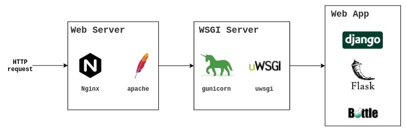

## Decorador (Decorator)

Um decorador é uma função que é utilizada para marcar/anotar outras funções para incrementar o funcionamento sem alterar no código ou afetar o princípio da responsabilidade única para funções. Basicamente é uma função **d** que recebe outra função **f** como argumento. A função decoradora pode fazer instruções antes ou depois de **f** e após sua execução retorna uma nova função **w** estende a função passada inicialmente. 


Decoradores são possíveis graças a aplicação dos conceitos de funções de alta ordem (HOF) e closures. Para uma demonstração simples do seu funcionamento vamos escrever algumas funções e um decorador que adicione logs e medição de desempenho.

Exemplo 1:

```py
def decorador(fn):
    def saudacao_melhorada():
        print("Bom dia")
        return fn()
    return saudacao_melhorada

def saudacao():
    print("Olá, mundo!")


saudacao_melhorada = decorador(saudacao)
saudacao_melhorada()
```
Esta estrutura para incrementar o comportamento da função **saudacao** exige que escrevemos saudacao duas vezes e saudacao_melhorada 03 vezes no código. Estas repetições geraram desconforto e incentivaram e inclusão de uma sintaxe utilizando o operador **@** (PEP318).

Exemplo 2:

```py
def decorador(fn):
    def saudacao_melhorada():
        print("Bom dia")
        return fn()
    return saudacao_melhorada

@decorador
def saudacao():
    print("Olá, mundo!")


saudacao()
```

Para repassar possíveis parâmetros simples e parâmetros nomeados à função que desejamos chamar basta adicionar *args e **kwargs para a função interna.


Exemplo 3:

```py
def decorador(fn):
    def saudacao_melhorada(*args, **kwargs):
        print("Bom dia")
        return fn(*args, **kwargs)
    return saudacao_melhorada

@decorador
def saudacao(nome):
    print(f"Olá, {nome}!")


saudacao("turma")
```

No código a seguir o decorador foi construído e a função interna não necessita ter um nome representativo, visto que ela é apenas temporária. Observe que foi usado o decorador em várias funções diferentes e em todas elas o comportamento foi incrementado da mesma maneira. Nos exemplos a seguir o decorador de log_decorator chamado sempre que a função executou.

Exemplo 4: 
```py
def log_decorator(fn):
    def _(*args, **kwargs):
        print(f"função iniciada com valores {args}")
        result = fn(*args, **kwargs)
        return result
    return _

@log_decorator
def soma(a,b):
    return a+b

@log_decorator
def fatorial(n):
    if n == 0:
        return 1
    if n > 0:
        return n*fatorial(n-1)

@log_decorator
def fibonacci(n):
    if n == 0:
        return 0
    elif n == 1:
        return 1
    else:
        return fibonacci(n-1) + fibonacci(n-2)

print(soma(1,1))
print(fatorial(5))
print(fibonacci(5))


```

Os decoradores são utilizados frequentemente em bibliotecas e frameworks para adicionar as funcionalidades propostas por estes: Controle de acesso, execução de códigos de de baixo nível, manipulação de informações irrelevantes para a função mas essenciais para o funcionamento da aplicação. No módulo fastapi o decorador é usado para manipular as requisições web do protocolo HTTP, repassadas por um servidor web wsgi, retornando uma resposta



Como programador de uma aplicação web você não quer se preocupar com manipulação de protocolos de rede. Já existe complexidade alta para solucionar problemas da aplicação, comunicação com aplicações externas, tratamento de dados, repostas para o frontend e persistencia em banco de dados.


No exemplo a seguir está um framework web chamado Flask. Ele possui diversos decoradores que podem ser utilizados. Neste caso será usado para permitir o acesso à uma página se o usuário estiver logado.

```py
import functools
from flask import Flask, g, request, redirect, url_for

app = Flask(__name__)

def login_required(func):
    """Make sure user is logged in before proceeding"""
    @functools.wraps(func)
    def wrapper_login_required(*args, **kwargs):
        if g.user is None:
            return redirect(url_for("login", next=request.url))
        return func(*args, **kwargs)
    return wrapper_login_required

@app.route("/secret")
@login_required
def secret():
    pass
```

### Decoradores para classes

There are two different ways that you can use decorators on classes. The first one is very close to what you’ve already done with functions: you can decorate the methods of a class.

Some commonly used decorators are even built-ins in Python, including @classmethod, @staticmethod, and @property. The @classmethod and @staticmethod decorators are used to define methods inside a class namespace that aren’t connected to a particular instance of that class. The @property decorator is used to customize getters and setters for class attributes. 


Exemplo:

```py
class Circle:
    def __init__(self, radius):
        self.radius = radius

    @property
    def radius(self):
        """Get value of radius"""
        return self._radius

    @radius.setter
    def radius(self, value):
        """Set radius, raise error if negative"""
        if value >= 0:
            self._radius = value
        else:
            raise ValueError("radius must be non-negative")

    @property
    def area(self):
        """Calculate area inside circle"""
        return self.pi() * self.radius**2

    def cylinder_volume(self, height):
        """Calculate volume of cylinder with circle as base"""
        return self.area * height

    @classmethod
    def unit_circle(cls):
        """Factory method creating a circle with radius 1"""
        return cls(1)

    @staticmethod
    def pi():
        """Value of π, could use math.pi instead though"""
        return 3.1415926535
```


The other way to use decorators on classes is to decorate the whole class. This is, for example, done in the dataclasses module:
```py
from dataclasses import dataclass

@dataclass
class PlayingCard:
    rank: str
    suit: str
```

### Nesting Decorators

You can apply several decorators to a function at once by stacking them on top of each other:
```py
from decorators import debug, do_twice

@debug
@do_twice
def greet(name):
    print(f"Hello {name}")
```

### Decoradores com argumentos
Sometimes, it’s useful to pass arguments to your decorators. For instance, @do_twice could be extended to a @repeat(num_times) decorator. The number of times to execute the decorated function could then be given as an argument.


```py
>>> from decorators import repeat

>>> @repeat(num_times=4)
... def greet(name):
...     print(f"Hello {name}")
...

>>> greet("World")
Hello World
Hello World
Hello World
Hello World
```

A construção do repeat poderia ser da seguinte forma:

```py
def wrapper_repeat(*args, **kwargs):
    for _ in range(num_times):
        value = func(*args, **kwargs)
    return value
```


### Exercício
1 - Faça uma pesquisa em como os decoradores são usados no módulos como fastapi, flask, celery, click, sqlalchemy, entre outros.

2 - Crie um decorador para registrar o tempo que uma função toma para concluir sua execução.  Utilize o módulo da biblioca padrão **time** para marcar o tempo inicial e final. Teste para as funções a seguir e explique o resultado:

3 - Refatorar um código que compara o tempo de execução entre listas Python e arrays NumPy, utilizando funções reutilizáveis e um decorator para medir o tempo de execução de forma mais organizada.

```py
import numpy as np
import time

# Lista Python
lista = list(range(1_000_000))
start = time.time()
lista_resultado = [x * 2 for x in lista]
print("Tempo com lista:", time.time() - start)

# NumPy array
array = np.array(lista)
start = time.time()
array_resultado = array * 2
print("Tempo com NumPy:", time.time() - start)

```

4 -  Crie um decorador que deixe a execução do código mais lento. Isso poderia ser útil para diminui a frequência de usode uma função eu verifique se um recurso foi alterado, como arquivos ou páginas web. 

5 - Pesquise no módulo **decorators**  e descreva os existentes

## Iterator (Iterador) e Iterable (Iterável) 

Iterator e Iterable são dois conceitos em Python para compreender melhor iterações. Iterator controla as repetições para realizar travessia de dados um por um. Iterable contém o dado que você quer enquanto percorre. 

Iterators were added to Python 2.2 through PEP 234. They were a significant addition to the language because they unified the iteration process and abstracted it away from the actual implementation of collection or container data types. 


Um iterador é um objeto que permite percorrer elementos iteráveis de uma coleção um por vez, como listas, tuplas, sets e dicionários.Python iterators implement the iterator design pattern, which allows you to traverse a container and access its elements. 

Iterators take responsibility for two main actions:

- Returning the data from a stream or container one item at a time
- Keeping track of the current and visited items

The most generic use case of a Python iterator is to allow iteration over a stream of data or a container data structure. Python uses iterators under the hood to support every operation that requires iteration, including for loops, comprehensions, iterable unpacking, and more. So, you’re constantly using iterators without being conscious of them.


Exemplo: A linguagem python usa iteradores internamente para implementações como o for

```py
for x in [1, 2, 3]:
    print(x)

## é transformado em:

iterador = iter([1, 2, 3])
while True:
    try:
        x = next(iterador)
        print(x)
    except StopIteration:
        break


```


### Criando um iterador

Para ser um iterador, temos que criar uma classe que tenha os métodos \__iter__() e \__next__()

```py 
class Contador:
    def __init__(self, limite):
        self.atual = 0
        self.limite = limite

    def __iter__(self):
        return self

    def __next__(self):
        if self.atual >= self.limite:
            raise StopIteration
        valor = self.atual
        self.atual += 1
        return valor

for numero in Contador(5):
    print(numero)

```

https://realpython.com/python-iterators-iterables/?utm_source=realpython&utm_medium=web&utm_campaign=related-post&utm_content=primer-on-python-decorators


## Gerador (Generator)

Python tem uma forma mais simples de criar iteradores: funções geradoras com yield.

```py
def contador(limite):
    atual = 0
    while atual < limite:
        yield atual
        atual += 1

for n in contador(5):
    print(n)

```

### Observações:

- Iteradores são consumíveis, ou seja eles só podem ser percorridos uma vez.

```py
it = iter([1, 2, 3])
next(it)  # 1
next(it)  # 2
next(it)  # 3
next(it)  
```

- for usa StopIteration para saber quando parar. Você nunca precisa mexer nele diretamente, mas precisa lançá-lo nos seus iteradores.


https://realpython.com/introduction-to-python-generators/?utm_source=realpython&utm_medium=web&utm_campaign=related-post&utm_content=primer-on-python-decorators


### Referências

https://www.datacamp.com/tutorial/decorators-python

https://realpython.com/primer-on-python-decorators/

https://www.geeksforgeeks.org/python/decorators-in-python/

https://peps.python.org/pep-0318/