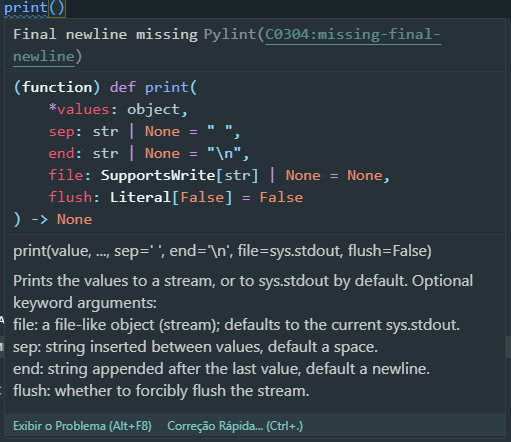

# Sintaxe e estilo

# Variáveis, constante e escopos

Variáveis são maneiras de se atribuir valores à nomes. Python é uma linguagem onde o tipo da variável é dinâmico, ou seja, não é necessário defini-lo antes da utilzação. É possível realizar operações sem conhecer o tipo da variável. O processo de atribuição de um valor à uma variável é chamado de atribuição, e é realizado com um sinal de igual, =, por exemplo:

```python
# nome=valor.
a = 1
b = 2
c = a + b
print(c)
```

# Tipos de dados (int, float, complex, boolean, string)

Python vem com alguns tipos básicos de objetos, dentre eles:

- bool: verdadeiro ou falso.
- int: números inteiros.
- float: números reais.
- complex: números complexos.
- str: strings (textos).

Outros tipos compotos sãos

- list: listas de dados de outros tipos.
- tuple: Tuplas de dados.
- dict: dicionários que mapeiam dois valores (chave e valor).

## Booleano: bool

Representam valores lógicos verdadeiro ou falso. Os valores possíveis são True e False (esses valores são sensíveis a maiúsculas e minúsculas). São comumente usados em expressões condicionais e operadores booleanos (or, and e not). Veja o exemplo :

```python
ativo = True
logado = False

if ativo and logado:
    print("Acesso liberado")
```

Os valores booleanos são fundamentais para a lógica de programação e para tomar decisões com base em condições.

## Inteiro: int

O tipo de dado "int" (inteiro) no Python é usado para representar números inteiros positivos, negativos ou zero, sem parte fracionária. Os valores inteiros são representados pelo tipo de objeto "int" e podem ser usados para realizar operações matemáticas, contagem, iterações e muito mais.

Aqui estão alguns exemplos de uso do tipo "int" no Python:

```python
x = 5
y = -10
z = 0

```

Você pode realizar várias operações matemáticas usando valores inteiros. Por exemplo:

```python
a = 10
b = 3

soma = a + b  # soma de dois inteiros
subtracao = a - b  # subtração de dois inteiros
multiplicacao = a * b  # multiplicação de dois inteiros
divisao = a / b  # divisão de dois inteiros (resulta em um float)
resto = a % b  # resto da divisão de dois inteiros
potencia = a ** b  # a elevado à potência b

print(soma, subtracao, multiplicacao, divisao, resto, potencia)

```

Além das operações matemáticas básicas, o tipo "int" também suporta outras operações, como operações de comparação (<, >, <=, >=, ==, !=) e operações lógicas (and, or, not).

```python
x = 5
y = 10

comparacao = x < y # Verifica se x é menor que y
igualdade = x == y # Verifica se x é igual a y
logica = (x < 10) and (y > 5) # Verifica se x é menor que 10 E y é maior que 5

print(comparacao, igualdade, logica)
```

Vale ressaltar que, no Python, os inteiros não têm um limite de tamanho fixo. O tamanho do inteiro é limitado apenas pela memória disponível no sistema. Isso significa que você pode realizar cálculos com números inteiros muito grandes sem se preocupar com um estouro de tamanho.

## Ponto Flutuante: float

O tipo de dado "float" (ponto flutuante) no Python é usado para representar números reais, ou seja, números com parte fracionária. Os valores "float" são representados pelo tipo de objeto "float" e podem ser usados para realizar operações matemáticas mais precisas.

Aqui estão alguns exemplos de uso do tipo "float" no Python:

```python
x = 3.14
y = -2.5
z = 0.0

```

É importante estar ciente de que operações de ponto flutuante podem levar a resultados aproximados devido à limitação da representação binária dos números reais. Isso ocorre devido a características da arquitetura dos computadores e à representação em base 2 dos números. Por exemplo:

```python
c = 0.1 + 0.2
print(c)  # Resultado: 0.30000000000000004

```

## Complexo: complex

O tipo de dado "complex" (complexo) no Python é usado para representar números complexos, que são uma combinação de uma parte real e uma parte imaginária. Os valores complexos são representados pelo tipo de objeto "complex" e podem ser usados para realizar operações matemáticas envolvendo números complexos.

Aqui estão alguns exemplos de uso do tipo "complex" no Python:

```python
z = 2 + 3j

print(abs(z))  # Valor absoluto de z
print(z.real)  # Parte real de z
print(z.imag)  # Parte imaginária de z
```

## Strings: str

Em Python, strings são demarcadas por aspas, tanto simples (') quanto duplas ("), mas somente uma ou outra dentro de uma string. Há um caso especial, utilizando aspas triplas (''' ou """), que é utilizado para linhas mais compridas de texto. Preferencialmente usamos aspas simples.

Strings são conjuntos imutáveis (não se preocupe com o termo agora) de caracteres. Python 3 utiliza, por padrão, o conjunto de caracteres Unicode, ou UTF-8. Isso significa que falantes de línguas como Português, que possuem diacríticos (á, à, ã, ç), podem facilmente utilizar strings com os caracteres nativos. Como já escrito, strings são sempre envolvidas por aspas simples ou duplas.

# Operadores (atribuição, aritméticos, relacionais e lógicos)

## Atribuição

1. Atribuição Simples

   Na atribuição simples, você usa o operador de atribuição (=) para associar um valor a uma única variável.

   ```python
   x = 10
   print(x)  # Saída: 10

   ```

2. Atribuição Múltipla

   A atribuição múltipla permite que você associe valores a várias variáveis em uma única instrução. Você pode separar as variáveis e os valores correspondentes por vírgulas. A ordem em que as variáveis estão dispostas a esquerda, receberá, na mesma ordem, os respectivos valores a direita.

   ```python
   a, b, c = 1, 2, 3
   print(a)  # Saída: 1
   print(b)  # Saída: 2
   print(c)  # Saída: 3

   ```

3. Atribuição Múltipla e Desempacotamento

   A atribuição múltipla também pode ser usada com o desempacotamento de sequências, como listas ou tuplas, onde o número de elementos na sequência corresponde ao número de variáveis.

   ```python
   lista = [10, 20, 30]
   x, y, z = lista
   print(x)  # Saída: 10
   print(y)  # Saída: 20
   print(z)  # Saída: 30

   ```

   Ainda é possível realizar a atribuição múltipla para algumas posiçõe iniciais descartar as demais. Isso pode ser feito com \*args. Veja o exemplo:

   ```python
   lista = [10, 20, 30, 40, 50, 60, 70]
   x, y, w, *resto = lista
   print(x)  # Saída: 10
   print(y)  # Saída: 20
   print(w)  # Saída: 30
   print(resto)  # Saída: [40, 50, 60, 70]
   ```
4. Expressão de Atribuição

   É possível realizar a atribuição em uma instrução e retornar o valor atribuído imediatamente utilizando o operador de expressão de atribuição. Este operador também é chamado de Walrus. Veja o exemplo a seguir:
   

   ```python
    >>> walrus = False
    >>> walrus
    False
    
    >>> (walrus := True)
    True
    >>> walrus
    True
   ```

   Em um primeiro momento não aparenta ter diferença, mas observe que ao atribuir o valor é retornado imediatamente e o valor também foi atribuído à variável.
   Ele pode ser utilizado em expressões aritméticas mais complexas e repetições. Veja os exemplos:

   ```python
    numbers = [2, 8, 0, 1, 1, 9, 7, 7]
    
    num_length = len(numbers)
    num_sum = sum(numbers)
    
    description = {
         "length": num_length,
         "sum": num_sum,
         "mean": num_sum / num_length,
     }
    
    print(description)
    # {'length': 8, 'sum': 35, 'mean': 4.375}
   ```

     ```python
   # Com o walruns
    numbers = [2, 8, 0, 1, 1, 9, 7, 7]
    
    description = {
         "length": (num_length := len(numbers)),
         "sum": (num_sum := sum(numbers)),
         "mean": num_sum / num_length,
     }
    
    print( description )
    # {'length': 8, 'sum': 35, 'mean': 4.375}
   ```
## Aritméticos

1. Adição (+):

   O operador + é usado para somar dois valores.

   Exemplo:

   ```python
   a = 5
   b = 3
   soma = a + b
   print(soma)  # Saída: 8

   ```

2. Subtração (-):

   O operador - é usado para subtrair um valor de outro.

   Exemplo:

   ```python
   a = 7
   b = 4
   diferenca = a - b
   print(diferenca)  # Saída: 3
   ```

3. Multiplicação (\*):

   O operador \* é usado para multiplicar dois valores.

   Exemplo:

   ```python
   a = 6
   b = 2
   produto = a * b
   print(produto)  # Saída: 12
   ```

4. Divisão (/):

   O operador / é usado para realizar a divisão entre dois valores. O resultado é um número de ponto flutuante. Exemplo:

   ```python
   a = 1
   b = 3
   quociente = a / b
   print(quociente)  # Saída: 0.3333333333333335

   ```

   [Entenda mais sobre pontos flutuantes](https://0.30000000000000004.com/)

5. Divisão inteira (//):

   O operador // é usado para realizar a divisão inteira entre dois valores. O resultado é o quociente da divisão como um número inteiro, arredondado em direção a menos infinito.

   Exemplo:

   ```python
   a = 10
   b = 3
   quociente = a // b
   print(quociente)  # Saída: 3

   ```

6. Resto da divisão (%):

   O operador % retorna o resto da divisão entre dois valores.

   Exemplo:

   ```python
   a = 10
   b = 3
   resto = a % b
   print(resto)  # Saída: 1
   ```

7. Operadores Compostos: Atribuição Operação Aritmética

   O operador de atribuição (=) é usado para atribuir um valor a uma variável. Você pode combinar o operador de atribuição com os operadores matemáticos para realizar operações e atribuir o resultado a uma variável. Exemplo:

   ```python
   a = 5  # Atribuição inicial
   b = 3

   # Utilizando operadores matemáticos em conjunto com o operador de atribuição
   a += b  # Equivale a: a = a + b
   print(a)  # Saída: 8

   a -= b  # Equivale a: a = a - b
   print(a)  # Saída: 5

   a *= b  # Equivale a: a = a * b
   print(a)  # Saída: 15

   a /= b  # Equivale a: a = a / b
   print(a)  # Saída: 5.0 (resultado é um número de ponto flutuante)

   a //= b  # Equivale a: a = a // b
   print(a)  # Saída: 1 (resultado é um número inteiro)

   a %= b  # Equivale a: a = a % b
   print(a)  # Saída: 1

   a **= b  # Equivale a: a = a ** b
   print(a)  # Saída: 1

   ```

## Operador de Associação e Identidade

1. Identidade
   Este operador é utilizado para comparar objetos, verificando se os objetos testados referenciam o mesmo objeto

   ```python
   lista = [1, 2, 3]
   outra_lista = [1, 2, 3]
   recebe_lista = lista

   # Recebe True, pois são o mesmo objeto

   print(f"São o mesmo objeto? {lista is recebe_lista}")

   # Retorna False, pois são objetos diferentes

   print(f"São o mesmo objeto? {lista is outra_lista}")
   ```

   Exemplo do operador **is not**

   ```python
   lista = [1, 2, 3]
   outra_lista = [1, 2, 3]
   print(lista is not outra_lista) # Retorna True pois são objetos diferentes.
   ```

2. Associação
   Eles servem para verificar se determinado objeto está associado ou pertence a determinada estrutura de dados.

   **in** Retorna True caso o valor seja encontrado na sequência
   **not in** Retorna True caso o valor não seja encontrado na sequência

   ```python
   lista = ["Python", "Operadores"]
   # Verifica se existe a string dentro da lista
   print('Python' in lista) # Saída: True
   # Verifica se não existe a string dentro da lista
   print('Javascript' not in lista) # Saída: True
   ```

### PEMDAS

O PEMDAS é um acrônimo que representa a ordem de precedência dos operadores matemáticos. Ele é usado para determinar a sequência correta de avaliação de expressões matemáticas complexas.

- P: Parênteses: os cálculos dentro de parênteses são realizados primeiro.

- E: Expoentes: as operações de exponenciação são realizadas em seguida.

- MD: Multiplicação e Divisão: as operações de multiplicação e divisão são realizadas da esquerda para a direita, na ordem em que aparecem na expressão.

- AS: Adição e Subtração: as operações de adição e subtração são realizadas da esquerda para a direita, na ordem em que aparecem na expressão.

Quando possuimos expressões complexas é recomendado sempre utilizar paranteses e evitar erros na expressão. Veja o exemplo:

```python
expressao = 3 + 4 * 2 / (1 - 5) ** 2

# Aplicando o PEMDAS passo a passo
passo1 = 1 - 5  # Resultado: -4
passo2 = (1 - 5) ** 2  # Resultado: 16
passo3 = 4 * 2  # Resultado: 8
passo4 = 3 + (4 * 2) / (1 - 5) ** 2  # Resultado: 3.5

print(expressao)  # Saída: 3.5

```

### Concatenação

Alguns operadores matemáticos podem ser utilizados em outros objetos, que não números, dependendo se a operação em si foi definida no objeto. Qual seria o resultado de aplicar uma operação de soma nos casos a seguir?

```python
print('ABC' + 'def')
print([1] + [2])
```

O mesmo não é possível para o operador de subtração, pois esta função não está implementada nesses objetos. Veremos como isso funciona nos métodos mágicos e métodos dunder.

## Operadores Relacionais

Os operadores relacionais, também conhecidos como operadores de comparação, eles obtém a relação do membro a esquerda com o membro a sua direita gerando um resultado booleano (Verdadeiro ou Falso).

1.  Igual a ==

    O operador == verifica se dois valores são iguais e retorna True se forem iguais, caso contrário, retorna False.

    ```python
    a = 5
    b = 3
    print(a == b)  # Saída: False
    ```

2.  Diferente (!=):
    O operador != verifica se dois valores são diferentes e retorna True se forem diferentes, caso contrário, retorna False.

    Exemplo:

    ```python
    a = 5
    b = 3
    print(a != b) # Saída: True
    ```

3.  Maior que (>):
    O operador > verifica se o valor à esquerda é estritamente maior que o valor à direita e retorna True se for, caso contrário, retorna False.
    Exemplo:

    ```python
    a = 5
    b = 3
    print(a > b) # Saída: True
    ```

4.  Menor que (<):
    O operador < verifica se o valor à esquerda é estritamente menor que o valor à direita e retorna True se for, caso contrário, retorna False.

    Exemplo:

    ```python
    a = 5

    b = 3
    print(a < b) # Saída: False

    ```

5.  Maior ou igual a (>=):
    O operador >= verifica se o valor à esquerda é maior ou igual ao valor à direita e retorna True se for, caso contrário, retorna False.

    Exemplo:

    ```python
    a = 5
    b = 3
    print(a >= b)  # Saída: True
    ```

6.  Menor ou igual a (<=):
    O operador <= verifica se o valor à esquerda é menor ou igual ao valor à direita e retorna True se for, caso contrário, retorna False.

    Exemplo:

    ```python
    a = 5
    b = 3
    print(a <= b) # Saída: False
    ```

## Operadores Lógicos

Os operadores lógicos são utilizados para realizar operações lógicas em expressões condicionais e avaliar a verdade ou falsidade de condições. Os operadores lógicos padrão no Python são and, or e not. Eles permitem combinar ou inverter condições para tomar decisões em seu código

1. Operador and (E lógico):

   Retorna True se todas as expressões forem verdadeiras. Caso contrário, retorna False.

   ```python
   a = 10
   b = 5
   c = 7

   if a > b and a > c:
   print("a é o maior número.")

   ```

2. Operador or (OU lógico):

   Retorna True se pelo menos uma das expressões for verdadeira. Retorna False apenas se todas as expressões forem falsas.

   ```python
   resposta ="s"

   if resposta == "s" or resposta == "sim":
      print("Você será incluído na lista de e-mails.")
   ```

3. Operador not (negação lógico):

   O operador not é usado para inverter o valor de uma expressão lógica. Se a expressão for True, o operador not retorna False, e se a expressão for False, o operador not retorna True. Aqui está um exemplo:

   ```python
   logado = False
   if not logado:
   print("Faça login para acessar a página.")
   ```

# Funções de Input/Output

No Python, as funções de input e output são usadas para interagir com o usuário e com o ambiente externo. Elas permitem que você receba dados de entrada (input) e exiba informações de saída (output).

## Input

A função input() recebe uma string que será impressa na linha de comando e é capaz de ler do teclado as informações digitadas pelo usuário da seguinte forma:

```sh
# Interpretador Python no Shell
>>> valor_lido = input("Digite um valor: ")
digite um valor: 10

>>> type(valor_lido)  # O valor lido é SEMPRE do tipo string
<class 'str'>
```

O valor retornado pela função é sempre do tipo string. Para transformar o valor lido de str para outros tipos é necessário converter. Para converter para int ou float pode-se usar as funções int() e float(), que convertem o valor lido para o tipo de dado esperado.

```sh
>>> valor_lido = int(input("digite um valor inteiro: "))
digite um valor inteiro: 10

>>> type(valor_lido)
<class 'int'>

>>> valor_lido + 10
20

>>> valor_lido = float(input("digite um valor decimal: "))
digite um valor decimal: 1.5

>>> valor_lido - 1
0.5

```

Após a conversão é possível realizar as operações aritméticas com números. Caso não fizermos a conversão o que ocorreria com o resultado?

## Output

A função de print() é usada para exibir informações para o usuário ou gravá-las em um arquivo ou em outro dispositivo de saída. Aqui está um exemplo simples de uso da função print():

```python
nome = "João"
idade = 25
print("O nome é", nome, "e a idade é", idade)

```

## Conhecendo mais funções

Uma função é basicamente uma caixa preta de código, que recebeu um nome específico. De forma geral, são passados dados (parâmetros) para os argumentos de uma função que executa algumas instruções e então retorna algum valor.

### Argumentos e Retorno

No exemplo a seguir utilizamos a função print passando um argumento à ela, uma string 'Hello world!'. Ao longo de seu funcionamento a função imprime na tela o que foi fornecido a ela. Esta função não possui nenhum retorno (na verdade retorna um tipo None)

```python
dado = print('hello word')
# hello word
dado
type(dado)
# <class 'NoneType'>
```

Uma função pode ou ter receber argumentos. Para executar uma função é necessario, após o nome de uma função, colocar parênteses. Caso não coloquemos paranteses a função pode ser considerada como um tipo de dado.

```python
# Interpretador Python
type(print)
# <class 'builtin_function_or_method'>
```

Caso a função não tenha argumentos, não haverá nada dentro dos parênteses. Algumas funções aceitam mais de um argumento, e esses devem ser separados por vírgulas.

### Conhecendo a função melhor

Podemos conhecer o funcionamento de funções a partir da documentação. Desta forma conhecemos o que ela faz, os argumentos e retorno.

Também podemos visualizar isto pelos recursos da IDE/Editor de código colocando o cursos do mouse em cima do texto da função ou pela função help() do Python. Veja o exemplo:



```python
help(print)
Help on built-in function print in module builtins:
"""
print(...)
    print(value, ..., sep=' ', end='\n', file=sys.stdout, flush=False)

    Prints the values to a stream, or to sys.stdout by default.
    Optional keyword arguments:
    file:  a file-like object (stream); defaults to the current sys.stdout.
    sep:   string inserted between values, default a space.
    end:   string appended after the last value, default a newline.
    flush: whether to forcibly flush the stream.
"""
```

Para a função print o primeiro parâmetro é o valor a ser impresso. Os demais não são obrigatórios. Executando a função print com e sem parâmetros.

```python
print("Hello world!")
print()
print('Hello world!')
```

Executando a função print com um arquivo para que a saída não vá direto para a saída padrão do sistema (terminal de texto). Observe que o parâmetro file foi passado explicitamente. Caso contrário a sequência de valores deveria ser seguida (valor, separador, final, arquivo).

```python
f = open('file.txt','w')
print("hello word",file=f)
```

Agora, note que foram fornecidos dois argumentos, separados por vírgula. O que o comando print fez foi juntá-los com um espaço e colocar na mesma linha. O segundo parâmetro foi recebido como separador.

```python
print("hello word","!")
# hello word !
```

Uma outra forma mais segura para abrir, escrever e fechar o arquivo é com o uso do operador 'with'. Veja no exemplo a seguir:

```python
with open('file.txt','w') as f:
    print("hello word",file=f)
```
Exercício: Agora explore a documentação da função input().
