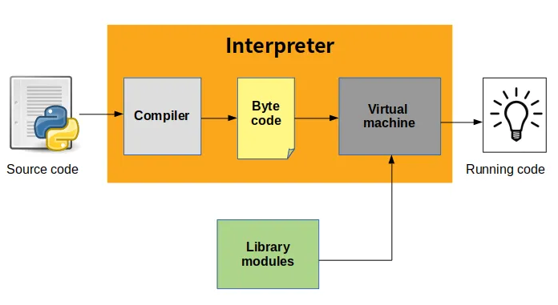
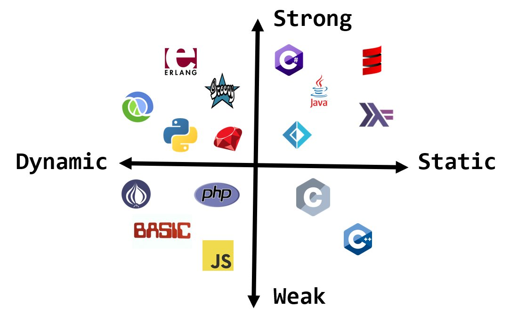
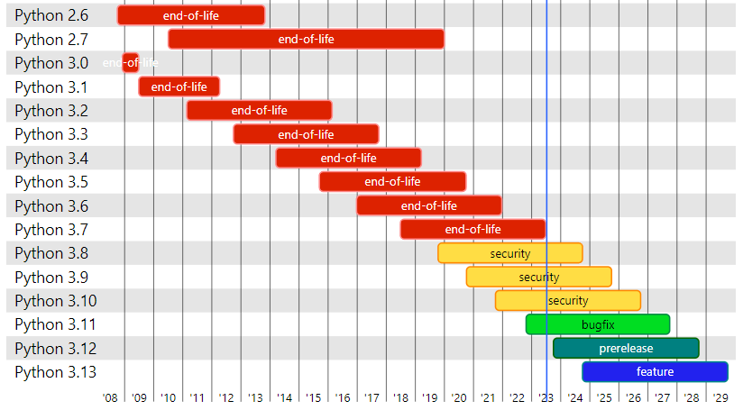
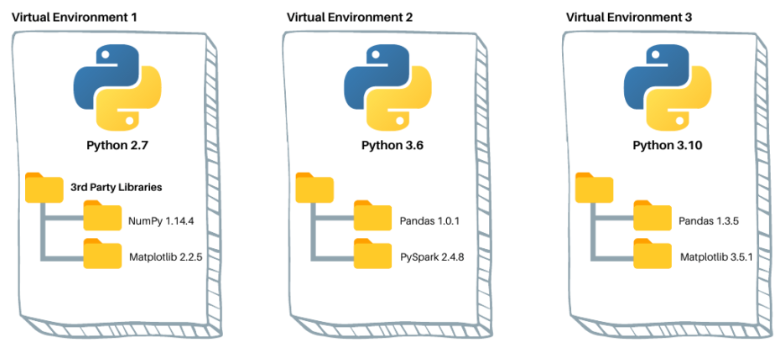

# Introdução à Linguagem de Programação Python

## Primeiro Programa

É praticamente uma regra que qualquer curso introdutório de programação mostre o mesmo exemplo: Como mostrar os caracteres "Hello world!" na tela.

```python
print('Hello world!')

```

## Linguagens de Programação

**Linguagens de programação são linguagens formais que foram projetadas para execução de instruções lógicas.** Linguagens formais são linguagens diferentes da normal e são usadas para aplicações específicas. Por exemplo, a notação que os matemáticos usam é uma linguagem formal que é particularmente boa para denotar relações entre números e símbolos. Os químicos usam uma linguagem formal para representar a estrutura química das moléculas.

Linguagens formais possuem regras sintáticas e semânticas para descrever o funcionamento e estrutura sem duplo sentido.Também são mais concisas e literais do que a linguagem normal, por isso constuma-se levar um tempo para se acostumar ao seu uso, principalmente se a diferença para a linguagem normal for muito grande.

Ao trabalhar com linguagens de programação você deve compreender quais instruções e qual a lógica para interpretação da máquina. Como são utilizadas para passar instruções que devem ser executadas por máquinas, não consideram contextos ou abstrações, são meros executores. Quem as escreve deve prezar pela objetividade e pelo princípio de funcionamento dos computadores: a eletrônica. Esta trabalha com informações elétricas que são mapeadas para bits (0's e 1's) e operam suas respectivas operações lógicas.

Veja a anedota a seguir e tente imaginar o motivo pelo qual o marido trouxe seis litros de leite.

> A esposa do programador disse:
>
> -Vá ao mercado e traga um litro de leite. Se tiver ovos, traga seis.
>
> O programador voltou com seis litros de leite, então sua esposa disse:
>
> -Programador! Porquê você trouxe seis litros de leite?
>
> E o Programador respondeu:
>
> -Eles tinham ovos...

É fácil compreender que o marido vai ter problemas pois tratou a esposa como máquina.

## Característicass da Linguagem Python

A linguagem Python tem por característica ser muito próxima à linguagem natural. É considerada como uma linguagem de altíssimo nível pois sua estrutura e instruções são de fácil entendimento, considerando o idioma inglês. Toda o conjunto de instruções, forma simplificada de uso e legibilidade a distinguem de outras linguagens de alto nível.

### Alto Níve x Baixo Nível

Também existem as linguagens de baixo nível, às vezes chamadas de "linguagens de máquina" ou "linguagens assembly" (linguagens de montagem). Com muita simplificação podemos dizer que o computador só consegue executar programas escritos em linguagens de baixo nível.

Programas escritos em linguagens de alto nível precisam ser processados antes que possam executar. Esse pré-processamento extra demanda mais tempo, o que é uma pequena desvantagem das linguagens de alto nível. Mas as vantagens são enormes:

- É muito mais fácil programar em uma linguagem de alto nível.
- É mais rápido escrever programas em uma linguagem de alto nível;
- Os programas ficam mais curtos, mais fáceis de ler, mais simples de alterar, e é mais provável que estejam corretos.
- Linguagens de alto nível são portáveis, o que significa que podem rodar em diferentes tipos de computador, com pouca ou nenhuma modificação e programas em baixo nível só podem rodar em um único tipo de computador e precisam ser re-escritos para rodar em outro tipo.

Devido a essas vantagens, quase todos os programas são escritos em linguagens de alto nível. As de baixo nível são utilizadas somente para umas poucas aplicações especializadas.

### Interpretada

Para executar um programa escrito na linguagem Python é necessário ter um programa, também chamado python. Ele é um **interpretador**. Irá verificar e executar cada instrução escrita no seu programa.

Você pode utilizar o interpretador executando instrução por instrução, verificando o resultado individualmente, ou executando um script (python arquivo.py).

No modo interativo cada instrução será executada e gera um retorno, se houver, imediato. Este modo é ótimo para conhecer a linguagem ou explorar recursos de módulos.

```sh
# Interpretador Python
> C:\Users\romulomenezesjr> python3
Python 3.10.11 (tags/v3.10.11:7d4cc5a, Apr  5 2023, 00:38:17) [MSC v.1929 64 bit (AMD64)] on win32
Type "help", "copyright", "credits" or "license" for more information.
>>> nums = range(1,10)
>>> list(nums)
[1, 2, 3, 4, 5, 6, 7, 8, 9]
```

Ao executar um script com o interpretador Python você deve passar o nome do arquivo à ele. Cada instrução escrita no arquivo deverá ser interpretada uma-a-uma. Veja no exemplo a seguir que existe um erro de tipo, mas como o interpretador não consegue chegar nesta instrução, o erro não é gerado.

```python {.line-numbers .highlight=3}
# arquivo.py

if False:
   num = 2/"2"
else:
    num = 0
print(num)
```

```sh
python3 arquivo.py
```

<p align="center">
  
</p>

Outra forma de gerar programas é a partir de linguagens compiladas. Um programa chamado compilador lê o código e o traduz completamente antes da execução. Após a etapa de compilação você pode executar repetidamente o programa sem que precise de nova tradução/interpretação.

<p align="center">
  
</p>

A linguagem Python internamente utiliza os processos, mas devido a forma com que você interage com essa linguagem, ela é em geral considerada uma linguagem interpretada. O código fonte é primeiramente compilado para uma linguagem de baixo nível, chamado de código em bytes ("byte code"), e então são interpretados por um programa chamado de máquina virtual.

<p align="center">
  
</p>

### Tipagem dinâmica

O Python usa tipagem dinâmica, o que significa que você pode atribuir e reatribuir uma variável àa diferentes tipos de dados. Isso torna o Python muito flexível na atribuição de tipos de dados; ela difere de outras linguagens que são tipadas estaticamente.

```python
# Python

# Atribuindo um inteiro à variável num
num = 3
print(num)

# Reatribuindo a lista dee inteiros à variável num
num = "1"
print(num)
```

Outras linguagens exigem que você especifique o tipo antes de criar uma variável para armazenar valores. A linguagem Java é estaticamente tipada.

```java
// Java

String fruta = "Laranja"
fruta = 1 // Exception
```

A tipagem dinâmica é mais fácil de trabalhar e possibilita que o tempo de desenvolvimento para pequenos programas seja mais rápido. Porém, pode resultar em bugs inesperados e em alguns momentos você precisa usar a função type().

### Fortemente tipada

Python é uma linguagem fortemente tipada, o que significa que o interpretador não faz conversões automáticas ou coersões. O programa feito em Python necessita de um tipo exato para realizar as operações. O interpretador faz uma verificação no conteúdo das variáveis no momento da execução de uma instrução. Esta verificação é consequência da tipagem dinâmica, pois nenhuma verificação foi feita anteriormente e nenhuma conversão é automática. Isso afeta o desempenho da execução em aplicações de _extremo_ processamento.

A linguagem Javascript tenta realizar conversões para executar uma operação. Isso é uma característica de linguagem fracamenta tipada.

```javascript
// Javascript

2 / "2";
1;
```

Este mesmo código em Python resultará em um erro de tipo, pois a operação só pode ser realizada entre números.

```python
# Python

2 / "2";
TypeError
```

A partir da versão 3.6 a linguagem possibilita anotações de tipos para melhor identificar o funcionamento do código. Além dos tipos básicos ainda há um módulo que pode ser importado para isso: typing

```python
# Python

from typing import List
num: int = 3
numeros: List = [1,2,3]
def soma(a:int, b:int)-> int:
    return a+b
```

Adicinar anotações de tipo não é uma obrigação na linguagem Python, mas pode documentar e ajudar quando trabalhamos com código longo, evitando erros e mantendo os tipos sem variações.



### Duck Typing

Outro termo usado para descrever a tipagem em Python é o _Duck Typing_. Pelo conceito: "Se algo parece com um pato, faz barulho de pato ou anda como um pato, então deve ser um pato".

Este conceito não observa o tipo de um objeto, apenas se ele é capaz de realizar uma operação. Em um programa, se algo possui um método então pode ser usado para determinado fim, sem que haja verificação de tipo. Este conceito é utilizado nos métodos mágicos e nos métodos _dunder_.

Exempo: A função len() do Python calcula o comprimento de algo (Strings, Listas, etc.). Ela não existe um tipo, mas solicita que o que esteja sendo passado à ela saida dizer seu tamanho.

```python
# Python

nome = "Maria"
numeros = [1,2,3]
len(nome)       # 5
len(numeros)    # 3
```

### PEP 20 - Modo de Programar Python

A linguagem Python é construída a partir de proposta para melhoramento do Python discutidas entre a comunidade de programadores. Estas propostas são chamadas de [PEP's (Python Enhancement Proposal)](https://peps.python.org/pep-0001/). Duas PEP's muito importantantes para compreender a estrutura da linguagem são a [PEP20](https://peps.python.org/pep-0020/) (estilo) e a [PEP8](https://peps.python.org/pep-0008/) (formatação). A PEP20 é chamada de modo Python de Programar e possui o seguinte conteúdo:

> Beautiful is better than ugly.\
> Explicit is better than implicit.\
> Simple is better than complex.\
> Complex is better than complicated.\
> Flat is better than nested.\
> Sparse is better than dense.\
> Readability counts.\
> Special cases aren't special enough to break the rules.\
> Although practicality beats purity.\
> Errors should never pass silently.\
> Unless explicitly silenced.\
> In the face of ambiguity, refuse the temptation to guess.\
> There should be one-- and preferably only one --obvious way to do it.\
> Although that way may not be obvious at first unless you're Dutch.\
> Now is better than never.\
> Although never is often better than _right_ now.\
> If the implementation is hard to explain, it's a bad idea.\
> If the implementation is easy to explain, it may be a good idea.\
> Namespaces are one honking great idea -- let's do more of those!

# Versões da linguagem

Com a evolução da linguagem são adicionadas novas funcionalidades, melhorias de desempenho e ferramentas para auxiliar no desenvolvimento. A seguir estão algumas versões e datas de lançamento. Veja o destaque para a documentação da versão 2.7, que foi muito utilizada e para a versão atual (3.11).

- Python 1.0 - Jan 1994
- Python 2.0 - Out 2000.
- [Python 2.7](https://docs.python.org/2.7/) - Jan 2010
- Python 3.0 - Dez 2008
- [Python 3.11.4](https://docs.python.org/3.11/) - Jun 2023.

Cada versão possui um ciclo de atualizações que é mantida por um período de tempo.
Essas atualizações podem ser para resolver bugs ou problemas de segurança. Atualizações menores, como da versão 3.11.1 para a 3.11.2 resolvem pequenos problemas. Novas funcionalidades são inseridas em versões maiores, como por exemplo: A mudança da versão 3.10 para 3.11 ocorre adição de funcionalidades propostas e aprovadas em PEP's.



Quando temos diferentes projetos que usam a linguagem Python é comum criarmos ambientes virtuais para a execução separada, assim as bibliotecas e versões de outros projetos não entram em conflito.



Para a versão 3.6+ estes ambientes virutais são criados com o comando.

```sh
python -m venv .venv
source .env/bin/activate
```

Para a versão 2.7 estes ambientes virutais são criados com o comando.

```sh
virtualenv -p /usr/bin/python2 env
source env/bin/activate
```

# Utilização e Ferramentas

## Web Development

Developing web applications with Python is one of the most in-demand skills, with a lot of opportunities for you out there. In this field, you’ll find several useful Python frameworks, libraries, and tools for developing cool web applications, APIs, and more. Here are some of the most popular Python web frameworks:

- Django Django is a high-level framework that encourages rapid web application development with a clean and pragmatic design. It allows you to focus on writing your applications without having to reinvent the wheel.
- FastAPI FastAPI is a fast and performant web framework for building web APIs. It’s built on top of modern Python type hint features and enables asynchronous programming.
- Flask Flask is a lightweight framework for creating WSGI web applications. It allows you to get started quickly and to scale up to complex applications if needed.

## CLI Development

Another field in which Python shines is command-line interface (CLI) application development. CLI applications are everywhere and allow you to automate repetitive and boring tasks in your day-to-day work by creating small and large tools for your command line.

In Python, you have an impressive set of CLI libraries and frameworks that can make your life more pleasant and help you build command-line tools quickly:

- argparse argprse is a standard library module that allows you to write user-friendly command-line interfaces. You can define the arguments you want to take at the command line and parse them nicely. It automatically generates help and usage messages and issues errors when your users provide invalid input.
- Click Click is a Python package for creating beautiful command-line interfaces with as little code as needed. It’s highly configurable and comes with sensible defaults out of the box. Its goals include making the process of writing command-line tools quick and fun.
- Typer Typer is a library for building CLI applications that users will love using and developers will love creating. It provides automatic help messages and automatic completion for all shells. It minimizes code duplication and facilitates debugging.

## GUI Development

traditional graphical user interface (GUI) applications for desktop environments is also an attractive option in Python. If you’re interested in building this kind of application, then Python has you covered with a wide range of GUI libraries, frameworks, and toolkits to choose from:

- Kivy Kivy is a library for rapid development of applications with innovative user interfaces, such as multi-touch applications. It runs on Linux, Windows, macOS, Android, iOS, and Raspberry Pi.
- PyQt PyQt is a set of Python bindings for the Qt application framework. It includes classes for building GUI applications. It also provides classes for networking, threads, SQL databases, and more. It supports the Windows, Linux, and macOS platforms.
- tkinter tkinter is a standard Python interface to the Tk GUI toolkit. It allows you to build GUI applications without the need for third-party dependencies. It’s available on most Unix platforms as well as on Windows systems.

## Game Development

Creating computer games is a great way to learn how to program not only in Python but also in any other language. To develop games, you’ll need to use variables, loops, conditional statements, functions, object-oriented programming, and more. Game development is an excellent option to integrate multiple skills.
You’ll find several tools, libraries, and frameworks for creating games quickly in the Python ecosystem. Here’s a small sample of them:

- Arcade Arcade is a Python library for creating 2D video games. It’s ideal for people learning to program because they don’t need to learn a complex game framework to start creating their own games.
- PyGame PyGame is a set of Python modules designed for writing video games. It adds functionality on top of the SDL library. It allows you to create full-featured games and multimedia programs. The library is highly portable and runs on several platforms and operating systems.
- pyglet pyglet is a powerful Python library for creating games and other visually rich applications on Windows, macOS, and Linux. It supports windowing, user interface event handling, OpenGL graphics, loading images, and playing videos and music.

## Machine Learning

Machine learning can be the first step for someone interested in artificial intelligence. Machine learning studies algorithms that learn through experience. These algorithms build models based on samples of training data to make predictions and decisions.

- Keras Keras is an industrial-strength deep learning framework with an API designed for human beings. It allows you to run new experiments and try more ideas quickly. It follows best practices for reducing cognitive load.
- NLTK NLTK is a platform for building Python programs to work with human language data. It provides libraries for classification, tokenization, stemming, tagging, parsing, and semantic reasoning.
- PyTorch PyTorch is an open source machine learning framework that accelerates the path from research prototyping to production deployment.
- scikit-learn scikit-learn is an open source machine learning library that supports supervised and unsupervised learning. It’s an efficient tool for predictive data analysis that’s accessible to everybody and reusable in various contexts.
- TensorFlow TensorFlow is an end-to-end open source platform for machine learning. It has a comprehensive, flexible ecosystem of tools, libraries, and community resources that will help you build and deploy ML-powered applications.

## Computação Científica/Ciência de Dados

- [Numpy](https://numpy.org/): Pacote para computação científica que possui diversas funções de matemática, algebra linear e transofrmações de Fourier.
- [Scipy](https://www.scipy.org/): Pacote para computação com recursos para física, matemática e engenharia.
- [SimPy](https://simpy.readthedocs.io/en/latest/): Framwork para simulação de eventos. Pode simular aeroportos, rodovias, atendimentos ao cliente, etc.

## Data Analysis and Visualization

- Matplotlib: A library for creating static, animated, and interactive data visualizations in Python.
- pandas pandas is a powerful and flexible open source tool for analyzing and manipulating data. It provides fast, flexible, and expressive data structures to work with relational or labeled data.
- Seaborn : Data visualization library based on Matplotlib. It provides a high-level interface for drawing attractive and informative statistical graphics that allow you to explore and understand your data. It integrates closely with pandas data structures.

## Webscrapping

- [Beautiful](https://www.crummy.com/software/BeautifulSoup/bs4/doc/) Soup: Biblioteca python para recuperar dados de arquivos HTML e XML. Possibilita navegação, pesquisa, modificação e recuperação de informações no formato de árvores.
- [Requests](https://requests.readthedocs.io/en/latest/): Biblioteca python para recuperar conteúdo acesado via HTTP de forma simples.
- [Scrapy](https://docs.scrapy.org/en/latest/): Framework para realizar webcrawling em páginas web

## Devops

- [Ansible](https://www.ansible.com/): Ferramenta feita em Python para configurar, gerenciar e implantar aplicações. Segue o conceito de infraestrutura a partir do código.
- [Docker Compose](https://docs.docker.com/compose/): Ferramenta para criar e executar múltiplos containers Docker. A configuração é feita com um arquivo de descrição YAML e a ferramenta realiza os passos descritos.

## Software Testing

- doctest: doctest is a standard module that searches your docstrings for pieces of text that look like interactive Python sessions and executes them to verify that they work correctly.
- pytest: pytest is a robust and mature testing framework that allows you to write and automate tests. It can scale from small unit tests to complex functional tests for your applications and libraries.

## Banco de Dados

- sqlite3: sqlite3 is a lightweight disk-based database that doesn’t require a separate server process. It allows you to access databases using a nonstandard variant of SQL. It’s freely available and comes in the Python standard library.
- SQLAlchemys: A Python SQL toolkit and object-relational mapper for SQL databases.
- MongoEngine: MongoEngine is a document-object mapper for working with MongoDB using object-oriented programming in Python.
- MySQL Connector/Python MySQL: A self-contained Python driver for communicating with MySQL servers.

## Software Packaging and Deployment

- Flit: A tool that provides a quick way to put your Python packages and modules on PyPI. It helps you set up the information about your package, so you can publish it to PyPI with minimal effort.
- Poetry Poetry is a tool for creating, building, installing, and packaging Python projects. It also allows you to publish your projects to PyPI. It tracks and resolves your project’s dependencies. It uses your current virtual environments or creates new ones to isolate your packages from your system-wide Python installation.
- PyInstaller PyInstaller is a tool that freezes Python applications into stand-alone executables that work under Windows, GNU/Linux, macOS, and others.

# Exercício

Faça uma pesquisa sobre as empresas que utilizam Python e as vagas de emprego existentes. Pesquisa os requisitos e faixa salarial.

# Referências

[Python Type Checking (Guide)](https://realpython.com/python-type-checking/)

[Linguagens Formais e Naturais](https://runestone.academy/ns/books/published/thinkcspy/GeneralIntro/FormalandNaturalLanguages.html)

[Versões do Python](https://www.python.org/doc/versions/)
