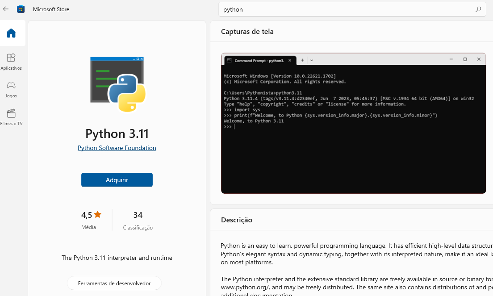
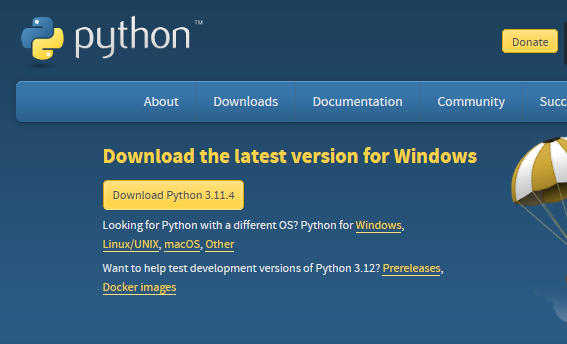

# Introdução à Linguagem de Programação Python

## Sumário

- 🎉 [Primeiro Programa](#primeiro-programa)
- 📓 [Vscode e Extensões](#vscode--extensões)
- 💻 [Linguagens de Programação](#linguagens-de-programação)
- 🐍 [Linguagem Python](#linguagem-python)

## Primeiro Programa

É praticamente uma regra que qualquer curso introdutório de programação mostre o mesmo exemplo: Como mostrar os caracteres "Hello world!" na tela.

```python
print('Hello world!')

```

Para gerar este primeiro programa em Python basta criar um arquivo de texto no Windows, salvar o arquivo com o nome helloworld.py e executar o comando

```sh
python helloworld.py
```

## VSCode + Extensões

### VSCode

O Visual Studio Code é um editor de código-fonte leve, mas poderoso, que é executado em seu computador e está disponível para Windows, macOS e Linux. Ele vem com suporte integrado para JavaScript, TypeScript e Node.js e possui um rico ecossistema de extensões para outras linguagens e plataformas de execução (como C++, C#, Java, Python, PHP, Go, .NET).

- IntelliSense.

  Vá além do destaque de sintaxe e do preenchimento automático com o IntelliSense, que fornece preenchimentos inteligentes com base nos tipos de variáveis, definições de funções e módulos importados.

- Comandos Git integrados.

  Trabalhar com o Git e outros provedores de SCM nunca foi tão fácil. Analise diferenças, adicione arquivos ao stage e faça commits diretamente pelo editor. Faça push e pull de qualquer serviço SCM hospedado.

- Extensível e personalizável.

  Quer mais recursos? Instale extensões para adicionar novas linguagens, temas, depuradores e se conectar a serviços adicionais. As extensões são executadas em processos separados, garantindo que elas não retardem o seu editor.

- Implante com confiança e facilidade

  Com o Microsoft Azure, você pode implantar e hospedar seus sites React, Angular, Vue, Node, Python (e muito mais!) com confiança e facilidade.

### Extensão Python

A extensão Python do Visual Studio Code, desenvolvida pela Microsoft, é uma extensão rica em recursos para Python que é completamente gratuita. O VS Code irá sugerir automaticamente esta extensão quando você começar a criar um arquivo .py. Sua funcionalidade IntelliSense possibilita recursos úteis como auto-completar código, navegação e verificação de sintaxe.


[Python Extension](https://lightrun.com/wp-content/uploads/2023/03/python_for_vscode.png)

Nome: Python Preview
Link do Marketplace do VS: https://marketplace.visualstudio.com/items?itemName=dongli.python-preview

Nome: Python
Link do Marketplace do VS: https://marketplace.visualstudio.com/items?itemName=ms-python.python

Nome: Jupyter
Link do Marketplace do VS: https://marketplace.visualstudio.com/items?itemName=ms-toolsai.jupyter

## Instalação do Interpretador Python





Para testar se a instalação ocorreu corretamente:

Apertar CTRL+R e digitar cmd ou powershell

- Digitar cmd ou powershell na barra de endereço de uma janela do windows explorer.
- Clicar com o botão direito numa região vazia do windows explorer, com o Shift apertado, e clicar "Abrir janela de comando/powershell aqui".
- Digite python que inicia o interpretador interativo

## Arquivos .md, .py e .ipynb

- Markdown (.md)

  Um arquivo MD é um arquivo de texto criado usando um dos vários dialetos possíveis da linguagem Markdown. Ele é salvo em formato de texto simples, mas inclui símbolos de texto embutidos que definem como formatar o texto (por exemplo, negrito, recuos, cabeçalhos, formatação de tabela).

- Python Script (.py)

  Um arquivo PY é um arquivo de programa ou script escrito em Python, uma linguagem de programação orientada a objetos interpretada. Ele pode ser criado e editado com um editor de texto, mas requer um interpretador Python para ser executado.

- Jupyter Notebook (.ipynb)

  Um arquivo IPYNB é um documento de notebook usado pelo Jupyter Notebook, um ambiente computacional interativo projetado para ajudar os cientistas a trabalhar com a linguagem Python e seus dados. Ele contém todo o conteúdo da sessão do aplicativo da web Jupyter Notebook, que inclui as entradas e saídas de cálculos, matemática, imagens e texto explicativo.

## Linguagens de Programação

**Linguagens de programação são linguagens formais que foram projetadas para execução de instruções lógicas.** Linguagens formais são linguagens diferentes da normal e são usadas para aplicações específicas. Por exemplo, a notação que os matemáticos usam é uma linguagem formal que é particularmente boa para denotar relações entre números e símbolos. Os químicos usam uma linguagem formal para representar a estrutura química das moléculas.

Linguagens formais possuem regras sintáticas e semânticas para descrever o funcionamento e estrutura sem duplo sentido.Também são mais concisas e literais do que a linguagem normal, por isso constuma-se levar um tempo para se acostumar ao seu uso, principalmente se a diferença para a linguagem normal for muito grande.

Ao trabalhar com linguagens de programação você deve compreender quais instruções e qual a lógica para interpretação da máquina. Como são utilizadas para passar instruções que devem ser executadas por máquinas, não consideram contextos ou abstrações, são meros executores. Quem as escreve deve prezar pela objetividade e pelo princípio de funcionamento dos computadores: a eletrônica. Esta trabalha com informações elétricas que são mapeadas para bits (0's e 1's) e operam suas respectivas operações lógicas.

Veja a anedota a seguir e tente imaginar o motivo pelo qual o marido trouxe seis litros de leite.

> A esposa do programador disse:
>
> -Vá ao mercado e traga um litro de leite. Se tiver ovos, traga seis.
>
> O programador voltou com seis litros de leite, então sua esposa disse:
>
> -Programador! Porquê você trouxe seis litros de leite?
>
> E o Programador respondeu:
>
> -Eles tinham ovos...

É fácil compreender que o marido vai ter problemas pois tratou a esposa como máquina.

## Linguagem Python

Introdução à Linguagem Python

Python é uma das linguagens de programação mais populares e versáteis do mundo. Criada pelo programador Guido van Rossum e lançada pela primeira vez em 1991, Python é conhecida por sua sintaxe clara, legibilidade e facilidade de uso. Sua filosofia de design enfatiza a importância da legibilidade do código, tornando-a uma linguagem acessível tanto para iniciantes quanto para desenvolvedores experientes.

Uma das características distintivas do Python é a sua abordagem "batteries-included", o que significa que a biblioteca padrão da linguagem é abrangente e inclui uma ampla gama de módulos que tornam tarefas comuns de programação mais fáceis e rápidas de implementar. Além disso, Python possui uma comunidade de desenvolvedores muito ativa, o que resulta em uma vasta quantidade de bibliotecas e frameworks de código aberto disponíveis, permitindo que os programadores resolvam uma grande variedade de problemas de maneira eficiente.

A versatilidade do Python é outro fator-chave para sua popularidade. Ele é usado em uma variedade de domínios, incluindo desenvolvimento web, análise de dados, inteligência artificial, automação de tarefas, jogos e muito mais. A capacidade de escrever código Python em diversas plataformas, como Windows, macOS e Linux, também contribui para sua ampla adoção.

Seja você um iniciante na programação ou um desenvolvedor experiente, Python oferece uma experiência de desenvolvimento agradável e produtiva. Com sua comunidade ativa, facilidade de aprendizado e poderosas bibliotecas, Python continua a ser uma das linguagens mais procuradas e recomendadas para uma variedade de aplicações.

# Referências

[Linguagens Formais e Naturais](https://runestone.academy/ns/books/published/thinkcspy/GeneralIntro/FormalandNaturalLanguages.html)

[VSCode](https://code.visualstudio.com/docs)
